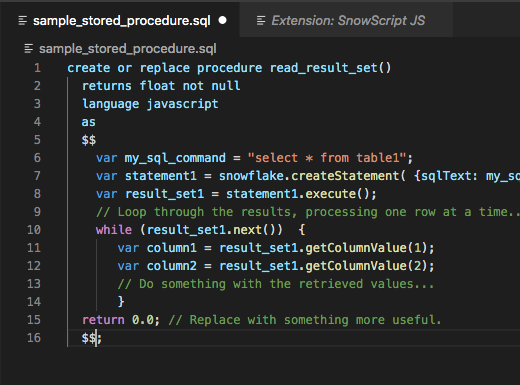
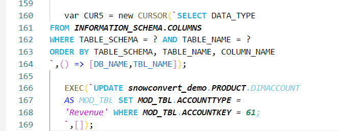
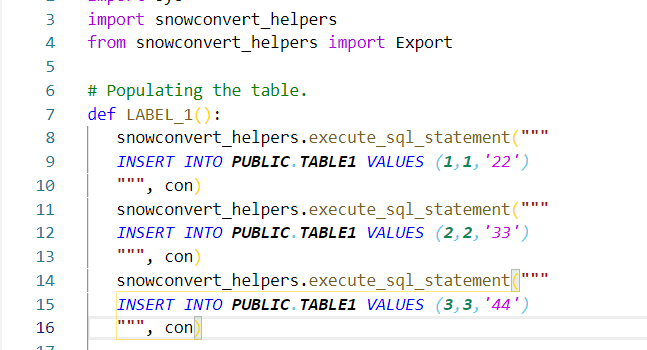

# Syntax Coloring for Snowflake Stored Procedures

This is a simple Syntax Coloring Extension for Snowflake Stored Procedures and now also for python scripts. 

This extension is more useful if you are using the SnowConvert tool to move code from Teradata, Oracle or SQL Server to Snowflake.

## Release Notes

### 1.0.0

Initial release of syntax coloring for SnowScript

### 1.0.1

Some minor reviews

### 1.0.2

Added support for doing SQL Syntax highlight. 
This is currently being done only inside EXEC(`sql`) 
or snowconvert_helpers.execute_sql_statement("""
sql
""")

### 1.0.3

Fixed issue that required a new line character for hightlight on `EXEC` or `CURSOR` calls.
Added support to hightlight the `snowflake.execute` and `snowflake.createStatement` calls as well.

# Examples

## General JS Highlight

## SQL Highlight inside the procedures

## SQL Highlight in python 

